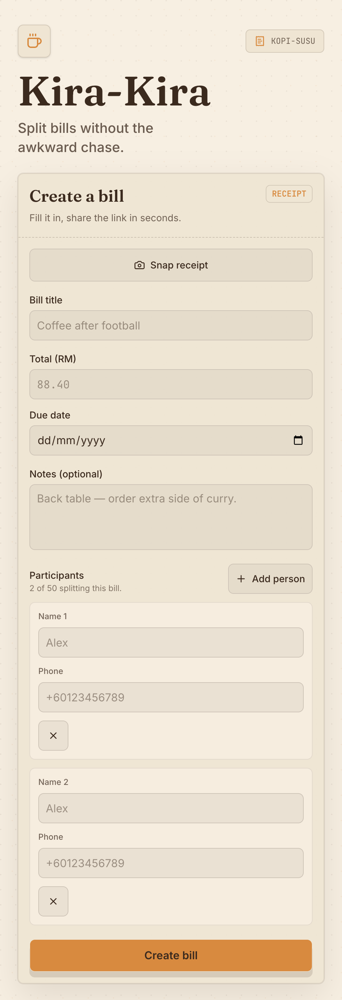
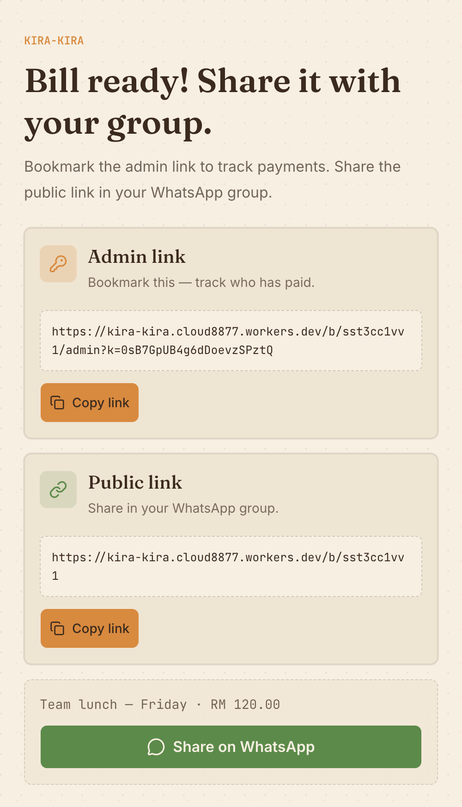
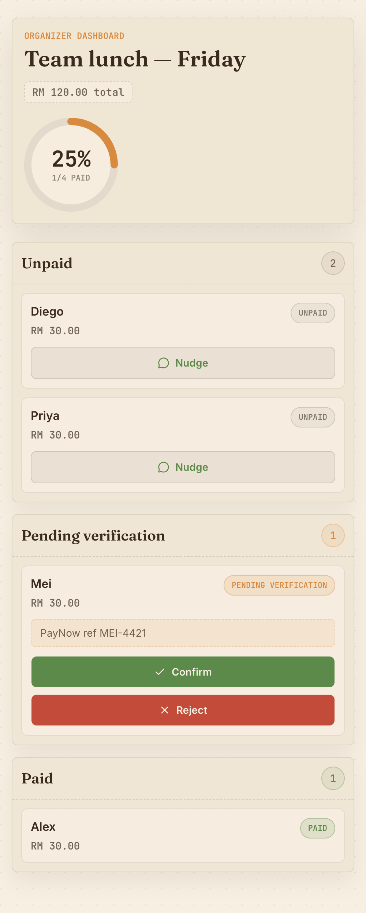

# Kira-Kira

> _Split bills without the awkward chase._

<p align="center">
  
</p>

A kopitiam-themed split bill + payment tracker built for the [Krackeddevs Split Bill bounty](https://krackeddevs.com/code/bounty/split-bill-payment-tracker-web-app).

Organizer creates a bill → shares one link in WhatsApp → members tap their name and mark themselves paid → organizer verifies. No accounts, no friction.

## Live demo

**👉 [kira-kira.cloud8877.workers.dev](https://kira-kira.cloud8877.workers.dev)**

<p align="center">
  
  &nbsp;
  
</p>

## Stack

- **Next.js 16** App Router (React 19, Server Actions)
- **Cloudflare Workers** via `@opennextjs/cloudflare` adapter (edge-deployed, global)
- **Cloudflare D1** (serverless SQLite) + **Drizzle ORM**
- **Tailwind v4** + **shadcn/ui** + **Zod** + **SWR**
- **canvas-confetti** (because every settled bill deserves celebration)

## Features

- 🧾 Create bills with title, total, due date, description, and dynamic participant list (1–50 people)
- 📷 **Snap a receipt** and autofill the title + total via Cloudflare Workers AI vision (free tier, runs at the edge)
- 🔗 Two-link sharing model: admin link to track, public link to share — secret in URL fragment, never server logs
- 📱 Mobile-first, designed for WhatsApp opens
- ⚡ Live dashboard via SWR polling (4-second refresh)
- 💬 Nudge unpaid people with one tap — auto-opens WhatsApp with the right text
- 🎉 Confetti when fully settled
- 🎨 Custom OG share card so WhatsApp previews look beautiful

### Receipt OCR + preview (bonus)

Tap **Snap receipt** at the top of the create-bill form to capture or upload a photo of a restaurant receipt. The image is stored to Cloudflare R2 *and* parsed in parallel through Workers AI (`@cf/mistralai/mistral-small-3.1-24b-instruct` primary, `@cf/meta/llama-3.2-11b-vision-instruct` fallback). The OCR result autofills the title + total non-destructively; the photo itself shows as a thumbnail and is included on both the public bill page (`/b/[id]`) and the organizer dashboard for everyone in the WhatsApp group to verify.

**Auto-delete: receipts vanish 7 days after upload** via a Cloudflare R2 bucket lifecycle rule (prefix `receipts/`). Pages that load an expired image gracefully show a "Receipt expired" placeholder instead of a broken-image icon.

Free Workers AI tier allows ~10,000 neurons/day; a vision pass typically costs 500–2,000 neurons. R2 free tier (10 GB storage, zero egress) covers any reasonable bounty/demo traffic.

## Bounty requirements coverage

| # | Requirement | Where it lives | Status |
|---|-------------|----------------|--------|
| 1 | Bill Creation | `components/CreateBillForm.tsx` + `app/actions/bills.ts` | ✅ |
| 2 | Shareable Bill Page | `app/b/[id]/page.tsx` + branded OG card at `/og.png` | ✅ |
| 3 | Member Payment Confirmation | `app/b/[id]/me/[pid]/page.tsx` + `app/actions/payments.ts` | ✅ |
| 4 | Organizer Dashboard | `app/b/[id]/admin/page.tsx` + `components/DashboardClient.tsx` | ✅ |
| 5 | Payment Progress Display | `components/ProgressRing.tsx` + 3-column board | ✅ |
| 6 | Mobile-Friendly Design | Tailwind mobile-first, all components verified at 390×844 | ✅ |
| 7 | Creative Theme / Branding | Kira-Kira / Kopi-Susu visual system | ✅ |
| 8 | GitHub Repository | https://github.com/cloud8877-source/kira-kira (public) | ✅ |
| 9 | Short Project Description | This README | ✅ |
| 10 | Optional Bonus Features | OG share card, live polling, nudge-on-WhatsApp, confetti, animated receipt, **receipt OCR via Workers AI** | ✅ Bonus |
| 11 | Minimum Acceptance Criteria | `scripts/e2e-check.sh` passes against deployed URL | ✅ |

## Running locally

```bash
nvm use # node 22
npm ci --ignore-scripts
npx wrangler d1 create kira-kira-db  # one time; copy the database_id into wrangler.jsonc
npm run db:generate
npm run db:apply:local
npm run dev      # next dev on port 8787 with local D1 emulation
```

Open http://localhost:8787.

## Deploying

```bash
npm run db:apply:remote  # apply migrations to production D1
npm run deploy           # opennextjs-cloudflare build + wrangler deploy
```

## Testing

```bash
npm test            # vitest, ~ 23 unit tests
npm run typecheck   # tsc --noEmit
./scripts/e2e-check.sh https://kira-kira.cloud8877.workers.dev
```

## Architecture

- **Database**: 2 tables (`bills`, `participants`) — see [`db/schema.ts`](./db/schema.ts)
- **Server actions** in `app/actions/` are thin wrappers around pure-function impls in `lib/{bills,payments}/`
- **Admin secret**: 16 random bytes, base64url, stored SHA-256 hashed, verified with `crypto.subtle.timingSafeEqual`
- **Money**: always integer cents in DB and in transit
- **Status flow**: `unpaid` → `pending` (member self-marked) → `paid` (organizer verified)

## License

MIT

---

Built with Claude Code + Codex.
